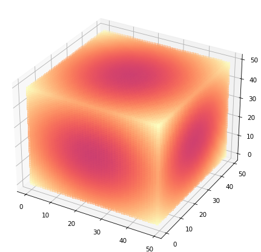
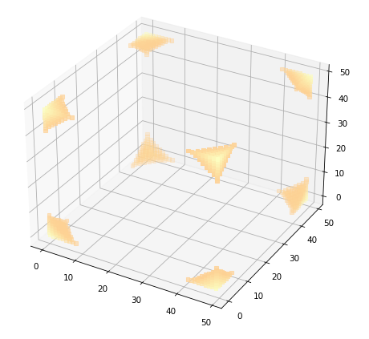
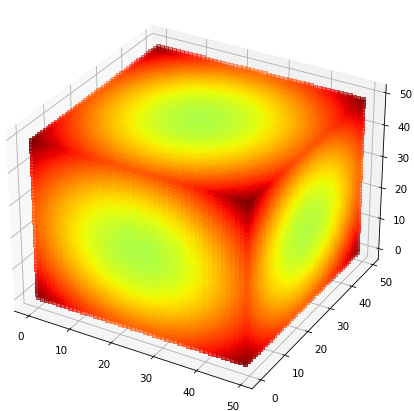

# Voxel-Plotter
A Python-based utility for visualizing fast 4D data (3 spatial dimensions + color channel) using matplotlib. The voxel plotter allows for a customizable display of data with controls for transparency threshold, skew factor, and sampling ratio. This tool is ideal for scientists, engineers, or anyone working with 3D data who wants to explore and understand their data in an interactive, visually appealing manner.

## Key Features
- Visualize 4D data (3 spatial dimensions + color channel) as 3D scatter plots.
- Control the transparency threshold, skew factor, and sampling ratio for customization.
- Supports data formats that include or exclude the channel as the first dimension.
- Uses matplotlib for plotting and NumPy for data handling.

## Prerequisites
Before you begin, ensure you have met the following requirements:
* You have installed the latest version of Python.
* You have installed the matplotlib and numpy python libraries.

## Function Parameters:

#### `data` (numpy.ndarray)
A 4D numpy array representing the voxel grid. The voxel grid serves as the base data for the 3D scatter plot.

e.g. (50,50,50,1)

#### `sampling_ratio` (float)
The sampling_ratio parameter determines the ratio of non-zero voxels that are sampled and plotted. It must be a number between 0 and 1. A lower sampling_ratio will result in a sparser visualization, but will also significantly speed up the plotting process because fewer points need to be processed and rendered. A ratio of 1 means all non-zero voxels are plotted, while a ratio of 0.5 means half of the non-zero voxels are plotted. 

This is especially beneficial when dealing with large 3D datasets, as visualizing all points could be computationally intensive and slow. By adjusting the sampling_ratio, you can find a balance between the level of detail in the visualization and the speed of generating the plot. 

| Low Sampling Ratio 0.1 | High Sampling Ratio 1 |
|:---:|:---:|
|  |  |

#### `transparency_threshold` (float)
This parameter sets a threshold below which voxel values are considered transparent. Higher values increase the overall transparency of the plot, while lower values make the plot more opaque. 

| Low Transparency Threshold 0 | High Transparency Threshold 0.9|
|:---:|:---:|
|  |  |

#### `skew_factor` (float)
The skew factor adjusts the emphasis on higher voxel values and suppresses lower ones during visualization. This can be useful for visualizing data with a large dynamic range.

| Low Skew Factor 1| High Skew Factor 2|
|:---:|:---:|
|  |  |

#### `colormap` (string)
The colormap of choice for the voxel plot. Different colormaps can provide different perspectives on the data.

| Magma Colormap | Jet Colormap |
|:---:|:---:|
|  |  |

#### `multi_view` (boolean)
This switch allows for the display of different views of the voxel plot. If set to True, the function will generate additional plots from various perspectives: top, bottom, front, left, and right, alongside the main perspective view. This is particularly useful when the 3D structure has complex internal features that may be obscured from a single view.

Remember that this parameter will generate multiple plots which may take more time and computational resources. If set to False, only the main perspective view will be generated.

| Various perspectives: top, bottom, front, left, and right, alongside the main perspective view |
|:---:|
|  |
---

The remaining parameters (`channel_first`, `save_img`) are boolean switches and their effect is more binary. Hence, they might not benefit as much from comparison images. 

